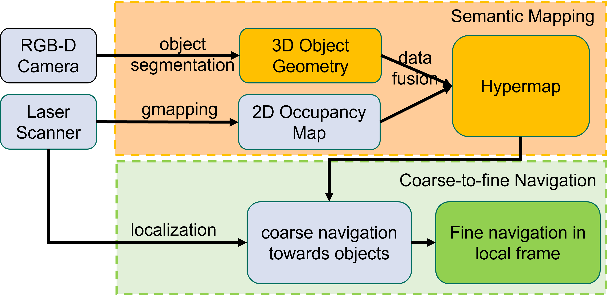
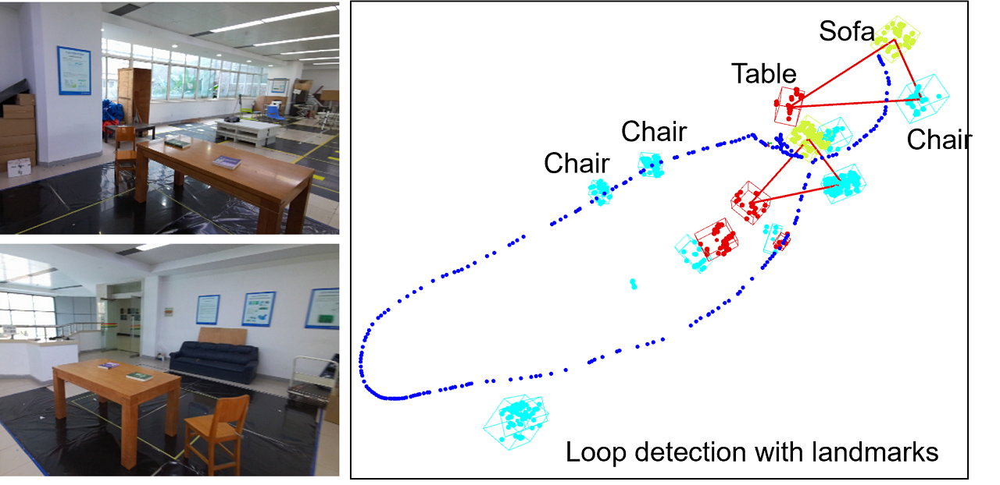
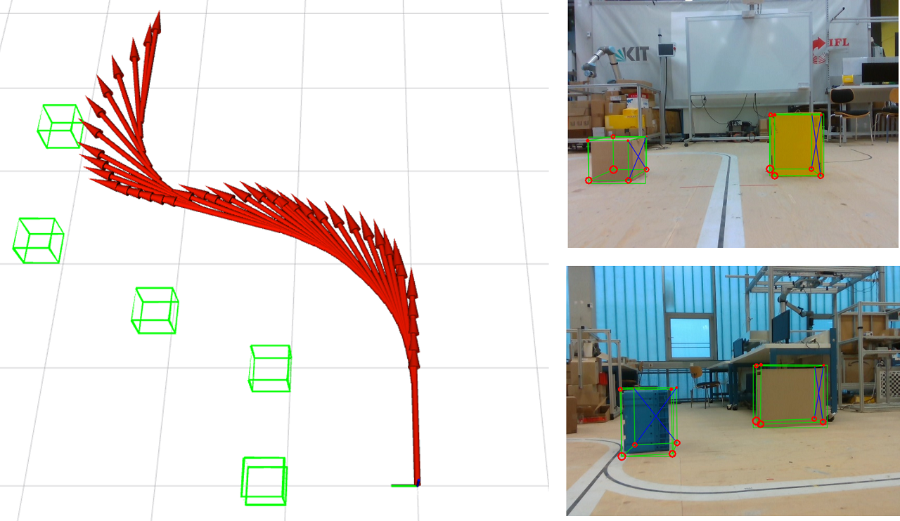
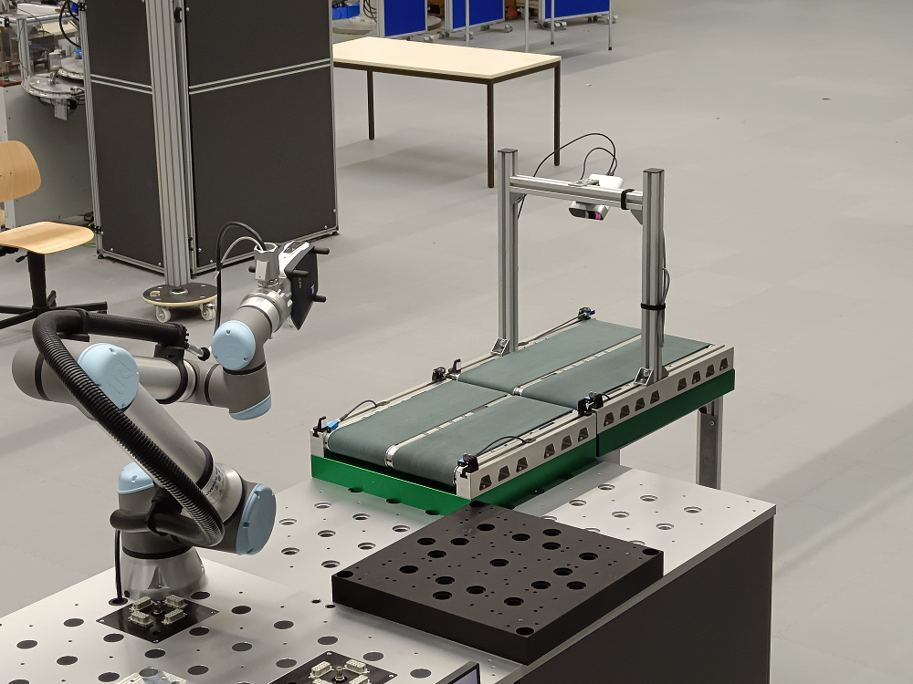
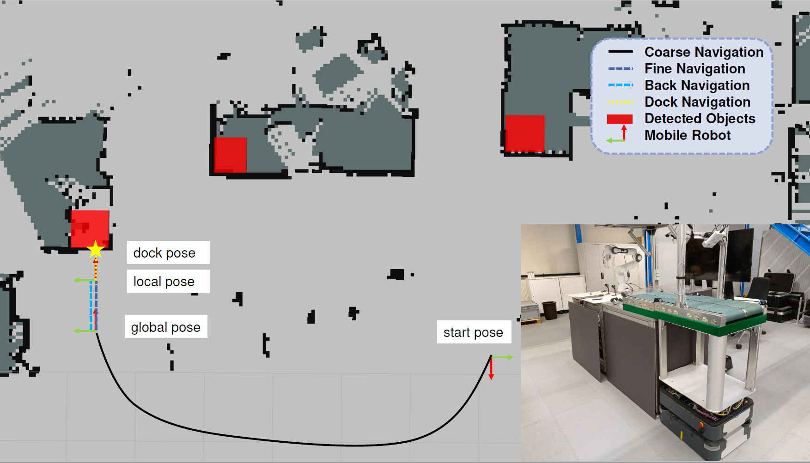
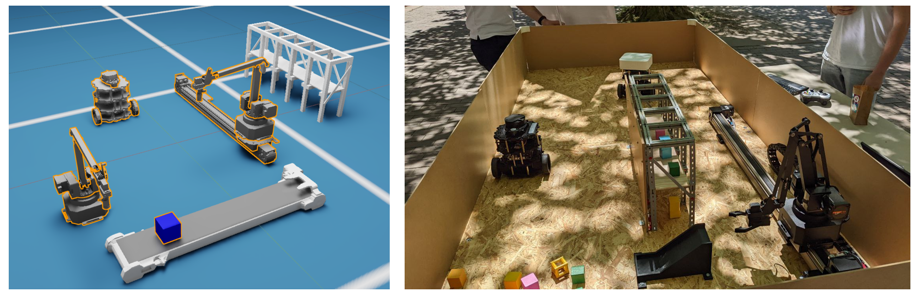
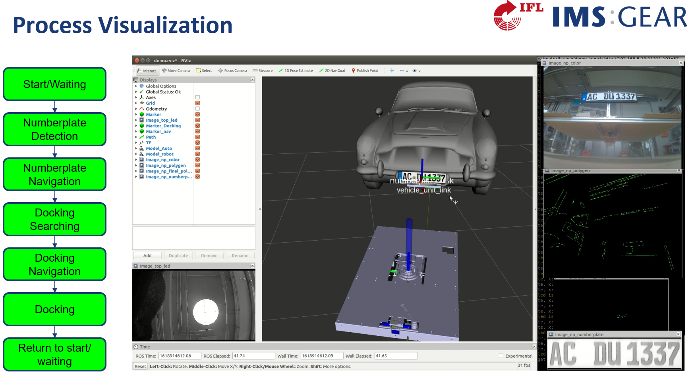

# Introduction

Welcome! My name is Benchun Zhou, Here are some research works and projects during my PhD studies, if you want to know more details of these projects, please click the external link to see the PDFs, or contact me (benchunzhou@gmail.com). I really appreciate your visit and suggestions, I hope you can get what you want. 

PS: For more projects during my master studies, please click here: [MasterToPhD](https://github.com/benchun123/MasterToPhD)

# Research Interests

*   Mobile Robotics
*   3D Object Detection
*   Visual Localization and Mapping 

# Overview
* Research
	* **`Doctoral Thesis`** [Visual Localization and Mapping with Objects in Logistics Environments](#1-doctoral-thesis-visual-localization-and-mapping-with-objects-in-logistic-environments)
	* **`Under Review 2023`**		  [Efficient Object-Level Semantic Mapping with RGB-D Cameras](#2-under-review-2023-efficient-object-level-semantic-mapping-with-rgb-d-cameras)
	* **`CASE 2023`**		  [Towards Autonomous Navigation for Agile Production System](#3-case-2023-towards-autonomous-navigation-for-agile-production-system)
	* **`Advanced Robotics 2022`**		  [Structure SLAM with Points, Plane, and Objects](#4-advanced-robotics-2022-structure-slam-with-points-plane-and-objects)
	* **`CASE 2022`**		  [Object-based Loop Closure with Oriented Histgram Descriptor](#5-case-2022-object-based-loop-closure-with-oriented-histgram-descriptor)
	* **`MFI 2021`**   	  [Object-based Localization and Mapping with Bbox Constraints](#6-mfi-2021-object-based-localization-and-mapping-with-bbox-constraints)

*  Projects
	* **`AgiProbot`** 	  [Towards Autonomous Navigation for Agile Production System](#7-agiprobot-towards-autonomous-navigation-for-agile-production-system)
	* **`SDM4FZI`** 	  [Digital Twin Implementation in Logistics Environments](#8-sdm4fzi-digital-twin-implementation-in-logistics-environments)
	* **`ACDU`** 		  [Automatic Connection Device Underbody](#9-acdu-automatic-connection-device-underbody)

*  Paper Survey
	* **`Object Detection`** 	  [Paper Survey Object Detection](#paper-survey-on-object-detection)
	* **`Object Association`** 	  [Paper Survey Object Association](#paper-survey-on-object-association)
	* **`Object SLAM`** 		  [Paper Survey Object SLAM](#paper-survey-on-object-slam)
	* **`Object Mapping`** 		  [Paper Survey Object Mapping](#paper-survey-on-object-mapping)
	* **`Visual SLAM`** 		  [Paper Survey Visual SLAM](#paper-survey-on-visual-slam)
	* **`Plane SLAM`** 		  [Paper Survey Plane SLAM](#paper-survey-on-plane-slam)

# Details
## 1. `Doctoral Thesis` [Visual Localization and Mapping with Objects in Logistics Environments]()

**Background:** Aiming at the lack of semantic information in the logistics map system, the doctoral thesis investigates the significance of objects within robot localization, and mapping systems.

**Object Detection:** Proposed three different methods to detect 3D objects from a single RGB-D frame with 3D cuboid representation. Experiments on SUN RGB-D dataset show that, the sample-score method outperforms the other two methods in speed (753ms per frame), but the deep learning method achieves the highest accuracy (3D IoU = 0.52, mAP@0.25=0.62). The geometry method provides a compromise between speed and accuracy. Considering different use-case, different methods can be employed.

**Object-based Localization:** Proposed a visual SLAM system to simultaneously localize camera pose and build the map with objects. On the top of the existing ORB-SLAM 2 system, planes and objects are detected in every key-frames, a new data association strategy is designed to associate these features, and all features are integrated to formulate a unified optimization problem for SLAM. Experiments on ICL-NUIM living room sequences show that, compared to other state-of-the-art visual SLAM systems, introducing objects can benefit scene understanding and camera localization. 

**Object-Level Mapping:** Presented an efficient semantic mapping pipeline to incrementally build a voxel-based map with individual objects. Experiments are designed on SceneNN dataset, the object points are detected and labelled in every frame, an object association strategy with geometry and semantic descriptor is conducted to track object information, and the objects are integrated into the voxblox framework to incrementally build a global object-level volumetric map while avoiding high computational costs.

**Experiments:** Evaluated the proposed methods on intra-logistics environments with KARIS PRO mobile platform to demonstrate the effectiveness and robustness in the real world. 

## 2. `Under Review 2023` [Efficient Object-Level Semantic Mapping with RGB-D Cameras](https://github.com/benchun123/object-level-mapping)

To autonomously navigate in real-world environments, mobile robots require a dense map to guarantee safety, but these maps always lack semantic information. When equipped with cameras, a lot of methods can create a dense semantic map, however, they suffer from critical run-time issues due to some heavy processing components. In this paper, we present an efficient semantic mapping system to incrementally build a voxel-based map with individual objects. Firstly, a frame-wise object segmentation scheme is adopted to segment 3D objects from RGB-D images. Then, a new object association strategy with geometry and semantic descriptor is proposed to track and update object information, Finally, the objects are integrated into a CPU-based voxel mapping approach to incrementally build a global object-level volumetric map while avoiding high computational costs.  Experiments on publicly available indoor datasets show that the proposed system performs better object segmentation than other object-level mapping methods while consuming less computational cost. Furthermore, the system is evaluated within a logistical robotic platform to demonstrate the use case in real-world applications.  

## 3. `CASE 2023` [Towards Autonomous Navigation for Agile Production System](https://github.com/benchun123/object-based-navigation)

A typical task for mobile robots in production logistics is to transport objects from one location to another. This requires the robots not only to locate the objects, but also to design a collision-free transport path. Currently, many mobile robots operate in an occupancy map, require a predefined goal pose as a destination, and lack the availability of high-level navigation. With the aid of RGB-D cameras, semantic objects can be detected and added to the map, providing more opportunities for scene understanding and flexible navigation. In this paper, we extend the current 2D mapping and navigation framework with object segmentation and fine position navigation to achieve better performances in task-level navigation. First, we propose a framework for creating and maintaining a hypermap by recognizing semantic objects in the environment and integrating them into an existing 2D occupancy map. Second, we present a coarse-to-fine navigation strategy on this hypermap. The coarse navigation receives object information and designs a global path towards the destination, while the fine navigation utilizes the local information to ensure a precise docking to the workstation. A field experiment demonstrates that the proposed system can achieve high performances in a production logistics environment.

## 4. `Advanced Robotics 2022` [Structure SLAM with Points, Plane, and Objects](https://github.com/benchun123/point-plane-object-SLAM)

Simultaneous localization and mapping (SLAM) is a fundamental problem for indoor mobile robots operating in unknown environments. While visual SLAM systems often use geometry features, the reconstructed maps lack semantic information. In this paper, we present a structure SLAM system with feature points, geometry planes, and semantic objects. Unlike other systems modelling planes and objects as collections of points, we choose a parametric representation for these landmarks. For every single frame, we start by generating cuboid candidates of detected objects with varying dimensions and orientations, then use 2D-3D fitting constraints to calculate the cuboid's translation, and finally introduce 3D spatial and 2D image constraints to select the best cuboid candidate. For SLAM optimization, the detected planes and objects can provide geometry constraints to improve the localization result, and act as landmarks to reconstruct a semantic map. Experiments on the ICL NUIM RGB-D dataset show that the proposed point-plane-object SLAM system can slightly improve localization accuracy, and is able to build a semantic map of the environment.

## 5. `CASE 2022` [Object-based Loop Closure with Oriented Histgram Descriptor](https://github.com/benchun123/object-based-loop-closure)

Loop closure can effectively eliminate the accumulated error in Simultaneous Localization and Mapping (SLAM). Appearance-based localization methods tend to fail under large viewpoint changes. In this paper, we propose a monocular SLAM system with object-based loop closure against viewpoint variation to achieve global localization. Objects are represented as cuboids and inferred from 2D object observation. On this basis, we construct a semantic topology graph from the objectoriented map and propose an efficient graph matching method with a directional histogram descriptor to detect the loop.Objects are matched if they satisfy general, graph and geometry verifications. By aligning the matched objects, the accumulated errors can be corrected, and the map can be updated. Experimental results demonstrate that the proposed method shows high accuracy and robustness under large viewpoint differences.

## 6. `MFI 2021` [Object-based Localization and Mapping with Bbox Constraints](https://github.com/benchun123/cuboid_slam_with_bbox_constraints)

In this paper, we present a three-dimensional object detection method for a single image and an object-based localization and mapping system. For 3D object detection, we firstly generate high-quality cuboid candidates by sampling object rotation and dimension. Then, the translation of each candidate is estimated in a closed form solution with camera projection function and bounding box constraints. Finally, all candidates are projected into the image, scored and selected based on the alignment with detected lines. To overcome object detection accuracy issues, the results are improved by multi-view optimization. Besides, objects can provide geometry constraints and semantic information to improve camera pose estimation and monocular drift. A point-object SLAM system is formulated to jointly optimize the poses of camera, objects and points. We evaluate our object detection method on objects from the KITTI, the SUN RGB-D and a self collected dataset. The results show that our method outperforms existing approaches. The point-cuboid SLAM experiments on the TUM RGB-D, ICL-NUIM and our self collected dataset show that our algorithm can improve both camera localization accuracy and 3D object detection accuracy

## 7. `AgiProbot` [Towards Autonomous Navigation for Agile Production System](https://github.com/benchun123/object-based-navigation)

"AgiProbot": Agile PROduction system using mobile, learning roBOTs with multi-sensors for uncertain product specifications.

This research project aims to develop a production system for remanufacturing, in which used products can be disassembled and recycled. 7 institutes participate, and we (IFL) develop an autonomous intralogistics system which realizes the material flow of the production system by means of driverless transport systems, smart transfer units and handling robots. To be specific, there are several workstations and transport robots, we are going to design an autonomous navigation system to delivery objects among these workstations.

## 8. `SDM4FZI` [Digital Twin Implementation in Logistics Environments](https://github.com/benchun123/Digital-Twin-Implementation)

In the automotive industry, Software Defined Manufacturing (SDM) technology was used to study the ability of systems to dynamically respond to production changes. The basic prerequisite is the abstraction of the hardware by digital twins with the help of which the software can be automatically derived and distributed.  Specifically, we are going to implement a digital twin system to study multi-robot system. 

## 9. `ACDU` [Automatic Connection Device Underbody](./R9_ACDU_Automatic%20Connection%20Device%20Underbody.pdf)

The research project aims to design an autonomous robot capable of docking a charger to electric cars from underbody. After search for many feasible solutions, we finally choose an infrared LEDs based solution with Jetson Nano and Raspberry Pi cameras. We implement different functions to realize docking, including number plate recognition, car localization, fine position navigation, etc. Furthermore, we evaluate the whole system in a test environments with a docking success rate of about 9/10.

# Bibliography

## * [Paper Survey on Object Detection](./Paper%20Survey%20on%20Object%20Detection.md)
## * [Paper Survey on Object Association](./Paper%20Survey%20on%20Object%20Association.md)
## * [Paper Survey on Object SLAM](./Paper%20Survey%20on%20Object%20SLAM.md)
## * [Paper Survey on Object Mapping](Paper%20Survey%20on%20Object%20Mapping.md)
## * [Paper Survey on Visual SLAM](./Paper%20Survey%20on%20Visual%20SLAM.md)
## * [Paper Survey on Plane SLAM](./Paper%20Survey%20on%20Plane%20SLAM.md)