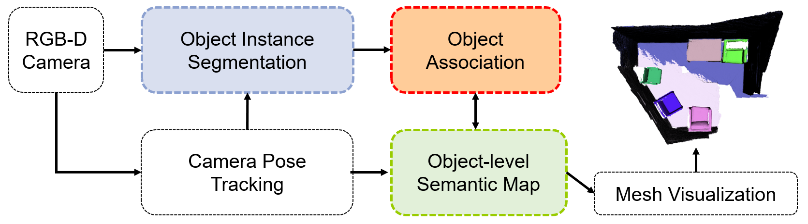
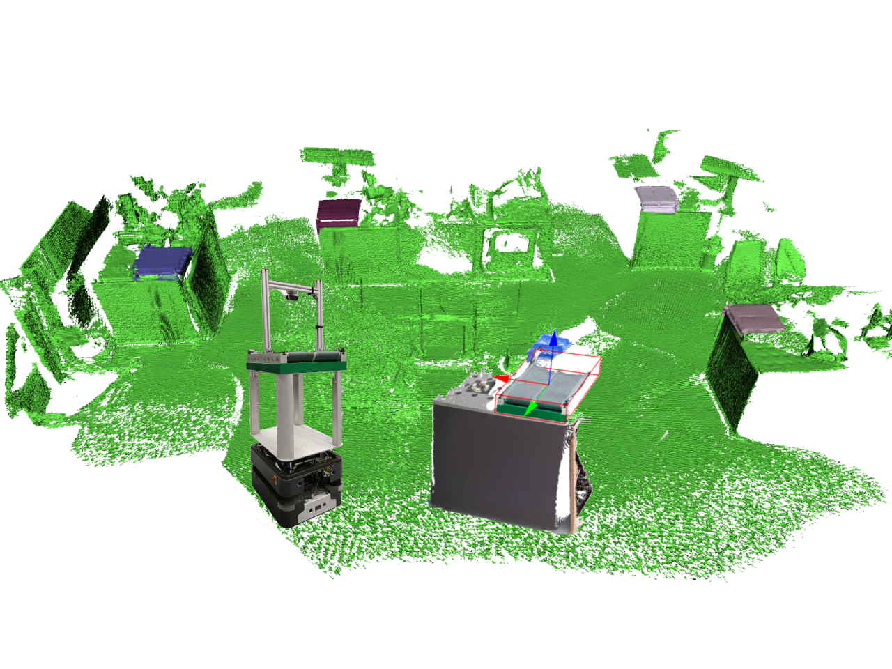
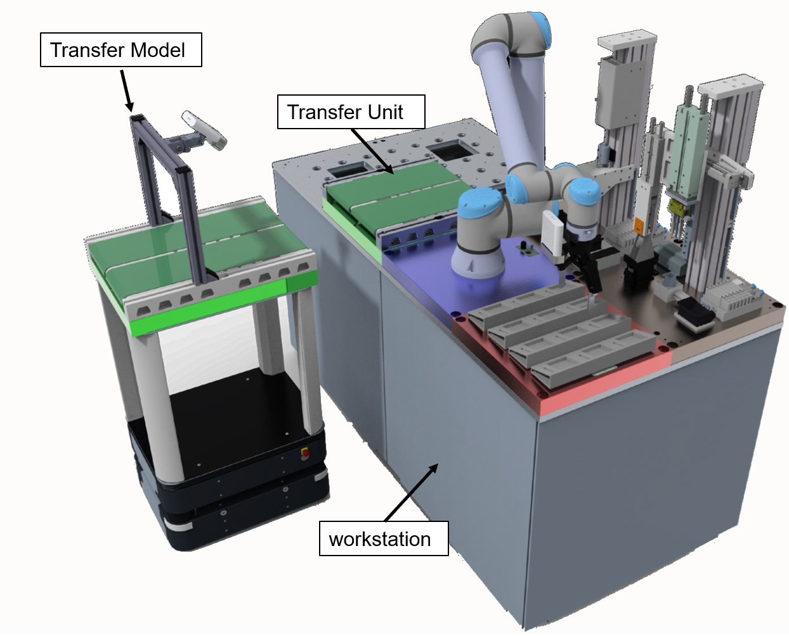
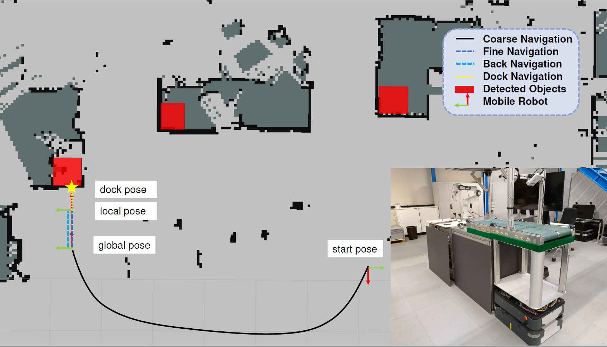
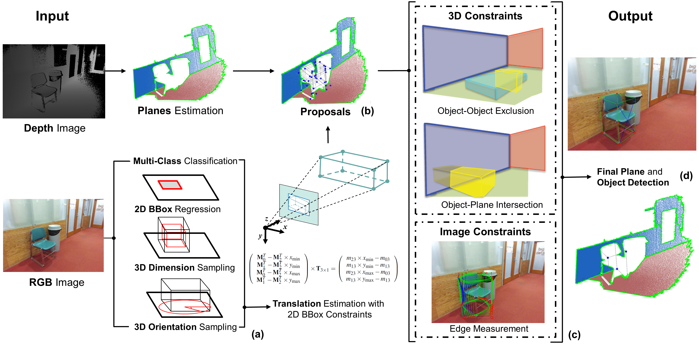
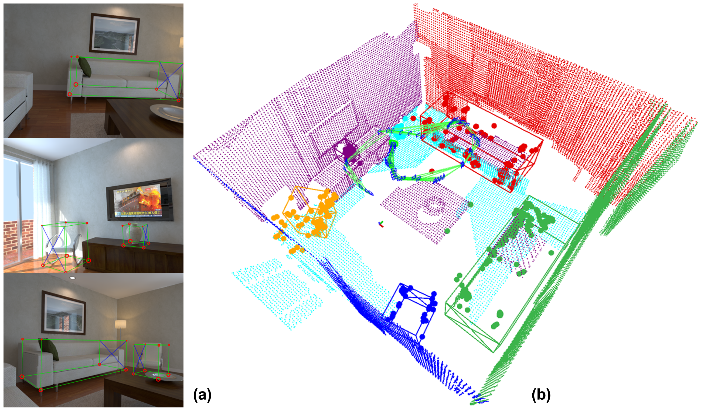
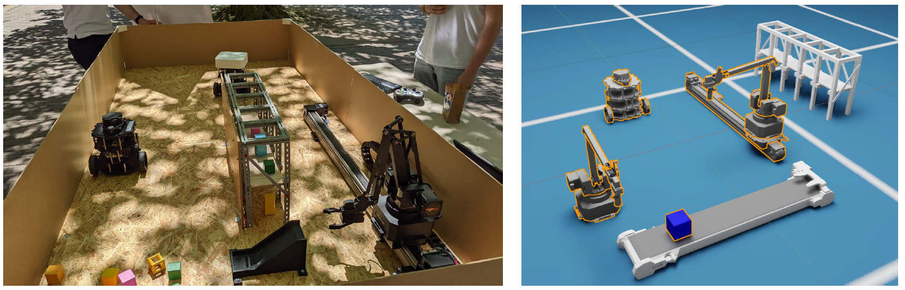

# Introduction

Welcome! My name is Benchun Zhou, Here are some research works and projects during my PhD studies, if you want to know more details of these projects, please click the external link to see the PDFs, or contact me (benchunzhou@gmail.com). I really appreciate your visit and suggestions, I hope you can get what you want. 

PS: For more projects during my master studies, please click here: [MasterToPhD](https://github.com/benchun123/MasterToPhD)

# Research Interests

*   Robotics
*   3D Object Detection
*   Visual Localization and Mapping 

# Overview
* Research
	* **`Doctoral Thesis`** [Visual Localization and Mapping with Objects in Logistic Environments](#1-doctoral-thesis-visual-localization-and-mapping-with-objects-in-logistic-environments)
	* **`Under Review 2023`**		  [Efficient Object-Level Semantic Mapping with RGB-D Cameras](#2-under-review-2023-efficient-object-level-semantic-mapping-with-rgb-d-cameras)
	* **`Under Review 2023`**		  [Towards Autonomous Navigation for Agile Production System](#3-under-review-2023-towards-autonomous-navigation-for-agile-production-system)
	* **`Advanced Robotics 2022`**		  [Structure SLAM with points plane and objects](#4-advanced-robotics-2022-structure-slam-with-points-plane-and-objects)
	* **`CASE 2022`**		  [Object-based Loop Closure with Oriented Histgram Descriptor](#6-case-2022-object-based-loop-closure-with-oriented-histgram-descriptor)
	* **`MFI2021`**   	  [Object-based Localization and Mapping with Bbox Constraints](#7-mfi-2021-object-based-localization-and-mapping-with-bbox-constraints)

*  Projects
	* **`Agiprobot`** 	  [Towards Autonomous Navigation for Agile Production System](#3-under-submission-2023-towards-autonomous-navigation-for-agile-production-system)
	* **`SDM4FZI`** 	  [Digital Twin Implementation in Logistic Environments](#5-sdm4fzi-digital-twin-implementation-in-logistic-environments)
	* **`ACDU`** 		  [Automatic Connection Device Underbody](#8-acdu-automatic-connection-device-underbody)

*  Paper Survey
	* **`Object Detection`** 	  [Paper Survey Object Detection](#paper-survey-on-object-detection)
	* **`Object Association`** 	  [Paper Survey Object Association](#paper-survey-on-object-association)
	* **`Object SLAM`** 		  [Paper Survey Object SLAM](#paper-survey-on-object-slam)
	* **`Object Mapping`** 		  [Paper Survey Object Mapping](#paper-survey-on-object-mapping)
	* **`Visual SLAM`** 		  [Paper Survey Visual SLAM](#paper-survey-on-visual-slam)
	* **`Plane SLAM`** 		  [Paper Survey Plane SLAM](#paper-survey-on-plane-slam)

# Details
## 1. `Doctoral Thesis` [Visual Localization and Mapping with Objects in Logistic Environments]()

TBD

## 2. `Under Review 2023` [Efficient Object-Level Semantic Mapping with RGB-D Cameras](https://github.com/benchun123/object-level-mapping)

To autonomously navigate in real-world environments, mobile robots require a dense map to guarantee safety, but these maps always lack semantic information. When equipped with cameras, a lot of methods can create a dense semantic map, however, they suffer from critical run-time issues due to some heavy processing components. In this paper, we present an efficient semantic mapping system to incrementally build a voxel-based map with individual objects. Firstly, a frame-wise object segmentation scheme is adopted to segment 3D objects from RGB-D images. Then, a new object association strategy with geometry and semantic descriptor is proposed to track and update object information, Finally, the objects are integrated into a CPU-based voxel mapping approach to incrementally build a global object-level volumetric map while avoiding high computational costs.  Experiments on publicly available indoor datasets show that the proposed system performs better object segmentation than other object-level mapping methods while consuming less computational cost. Furthermore, the system is evaluated within a logistical robotic platform to demonstrate the use case in real-world applications.  

## 3. `Under Review 2023` [Towards Autonomous Navigation for Agile Production System](https://github.com/benchun123/object-based-navigation)

A typical task for mobile robots in intra-logistics environments is to transport objects from one place to another. This requires the robots to not only locate the objects, but also design a collision-free path for the transport. Currently, many mobile robots operate in an occupancy map, they require a predefined coordinate as the goal and lack the availability of high-level navigation. With the aid of RGB-D cameras, semantic objects can be detected and added to the map, providing more possibilities for scene understanding and flexible navigation. In this paper, we extend current 2D mapping and navigation framework with object segmentation and fine position navigation to achieve better performance on task-level navigation. Firstly, we propose a framework to create and maintain a hypermap by recognizing semantic objects in the environment and integrating them into an existing 2D occupancy map. Secondly, we present a coarse-to-fine navigation strategy on this hypermap. The coarse navigation receives object information from the map and design a global path towards the destination, while the navigation utilizes the local information to ensure a precise dock to the object. A field experiment demonstrates that the proposed system can achieve high performance on autonomous navigation in an intra-logistic environment. 

## 4. `Advanced Robotics 2022` [Structure SLAM with Points, Plane, and Objects](https://github.com/benchun123/point-plane-object-SLAM)

Simultaneous localization and mapping (SLAM) is a fundamental problem for indoor mobile robots operating in unknown environments. While visual SLAM systems often use geometry features, the reconstructed maps lack semantic information. In this paper, we present a structure SLAM system with feature points, geometry planes, and semantic objects. Unlike other systems modelling planes and objects as collections of points, we choose a parametric representation for these landmarks. For every single frame, we start by generating cuboid candidates of detected objects with varying dimensions and orientations, then use 2D-3D fitting constraints to calculate the cuboid's translation, and finally introduce 3D spatial and 2D image constraints to select the best cuboid candidate. For SLAM optimization, the detected planes and objects can provide geometry constraints to improve the localization result, and act as landmarks to reconstruct a semantic map. Experiments on the ICL NUIM RGB-D dataset show that the proposed point-plane-object SLAM system can slightly improve localization accuracy, and is able to build a semantic map of the environment.

## 5. `SDM4FZI` [Digital Twin Implementation in Logistic Environments](./R5_Digital%20Twin%20Implementation%20in%20Logistic%20Environments.pdf)

The trend towards heterogeneous, decentral systems in intralogistics results in the need for a concept to describe and virtualize assets to enable their interaction. The multi-layer concept of Cyber-Physical Intralogistics Systems (CPIS) is introduced. The system description (descriptive layer) defines the structure of the digital twins and the communication (virtual layer) of physical (robots, periphery) and logical assets (control systems, simulations). To implement this concept, an experimental environment was developed at the Institute for Material Handling and Logistics and the Karlsruhe Institute of Technology. It consists of physical components, such as models of mobile robots or manipulators, and further periphery, such as racks and charging stations. The environment is supplemented by simulations and control software.

## 6. `CASE 2022` [Object-based Loop Closure with Oriented Histgram Descriptor](https://github.com/benchun123/object-based-loop-closure)

## 7. `MFI 2021` [Object-based Localization and Mapping with Bbox Constraints](https://github.com/benchun123/cuboid_slam_with_bbox_constraints)

## 8. `ACDU` [Automatic Connection Device Underbody](./R8_ACDU_Automatic%20Connection%20Device%20Underbody.pdf)

# Bibliography

## * [Paper Survey on Object Detection](./Paper%20Survey%20on%20Object%20Detection.md)
## * [Paper Survey on Object Association](./Paper%20Survey%20on%20Object%20Association.md)
## * [Paper Survey on Object SLAM](./Paper%20Survey%20on%20Object%20SLAM.md)
## * [Paper Survey on Object Mapping](Paper%20Survey%20on%20Object%20Mapping.md)
## * [Paper Survey on Visual SLAM](./Paper%20Survey%20on%20Visual%20SLAM.md)
## * [Paper Survey on Plane SLAM](./Paper%20Survey%20on%20Plane%20SLAM.md)